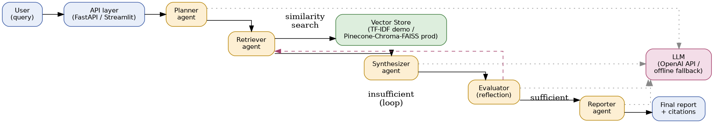
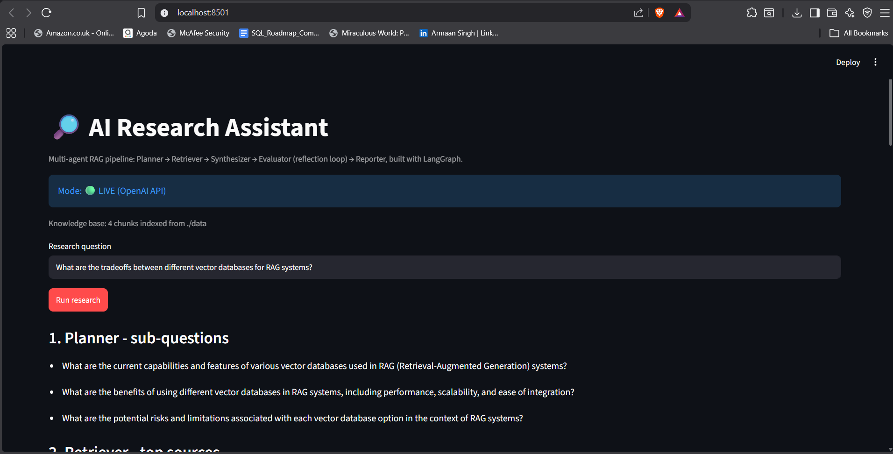
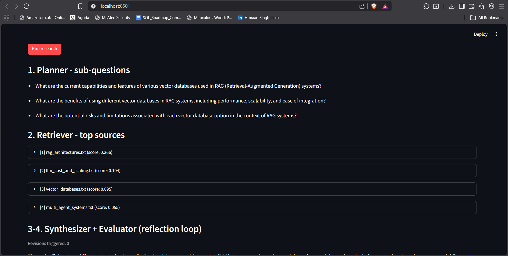
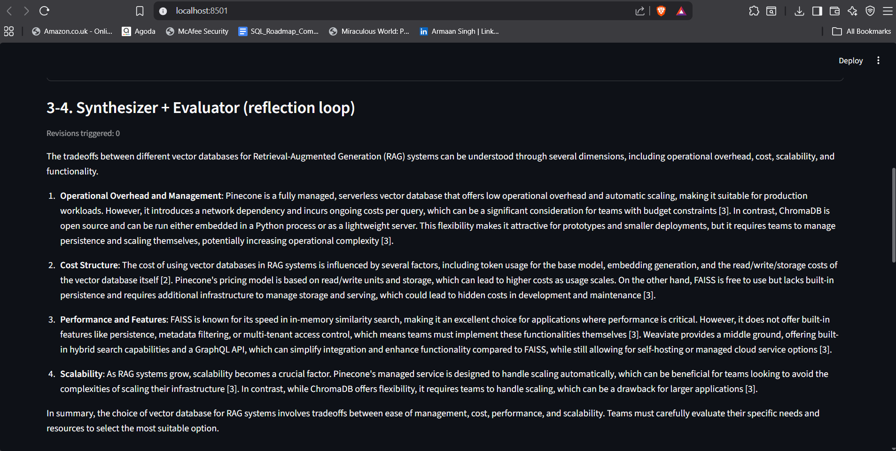
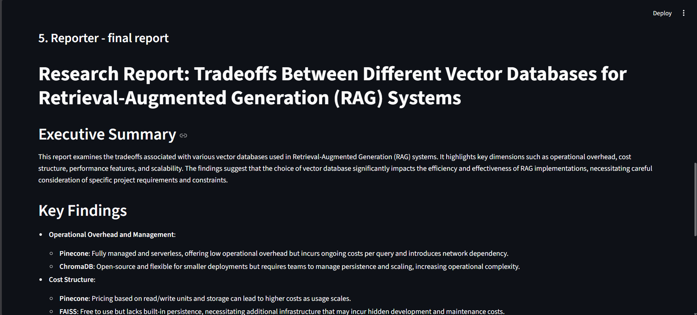
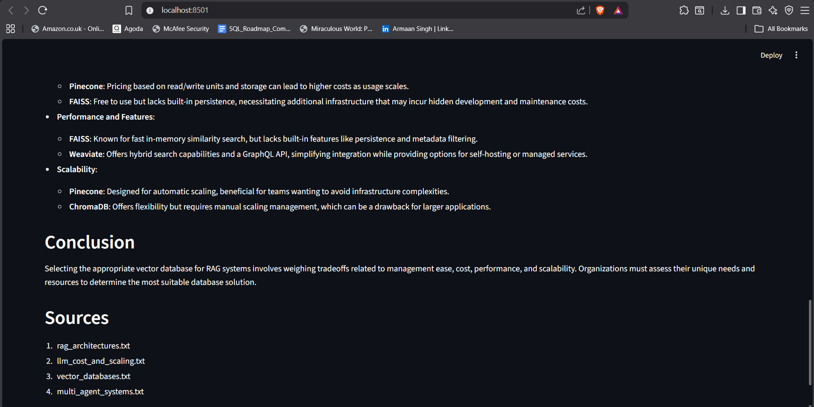

# AI Research Assistant — Multi-Agent RAG Prototype

A working prototype for the **AI Research Assistant** business workflow: given a
research question, a graph of specialized agents plans sub-questions, retrieves
grounded context from a document knowledge base, drafts a cited answer,
self-critiques it, and produces a polished final report.

Built with **LangGraph + LangChain-core + OpenAI API**, matching the stack used
in the accompanying resume's "AI Research Agent" and "Intelligent Study
Assistant" projects.

🔗 **Repository:** [github.com/armaan-arora/research_assistant_prototype_webvory](https://github.com/armaan-arora/research_assistant_prototype_webvory)

---

## 1. Project Overview

This project automates the early-stage research workflow that a business analyst,
product manager, or knowledge worker would otherwise do manually: reading through
multiple documents, pulling out relevant facts, cross-checking claims against
sources, and writing up a structured summary.

The system is a **5-agent LangGraph pipeline** — Planner, Retriever, Synthesizer,
Evaluator, and Reporter — that runs end-to-end from a single natural-language
question to a cited, structured report. It ships with two run modes (fully
offline/free, or live against the OpenAI API) and three interfaces (CLI, REST
API, Streamlit UI), so it can be evaluated with zero setup cost and extended into
a real integration.

---

## 2. Business Problem

Manual research and document synthesis is slow, inconsistent, and hard to scale:

- Analysts spend hours reading and cross-referencing multiple documents for a
  single question, and that time cost scales linearly with headcount.
- Manually written summaries vary in quality and structure from person to person,
  and are rarely traceable back to a specific source.
- Plain "ask an LLM" chat tools hallucinate confidently and don't show their
  work — there's no retrieval grounding and no self-check step.
- Knowledge scattered across many internal documents (wikis, PDFs, reports) is
  hard to query in natural language without a retrieval layer.

**The workflow this prototype automates:** a user asks a research question →
the system plans what to look for → retrieves grounded evidence from the
document base → drafts an answer using only that evidence → checks its own
answer for sufficient citation support (looping back to retrieve more if not)
→ produces a final report with sources listed. This turns an hours-long manual
task into a sub-minute, auditable, repeatable one.

---

## 3. AI Tools Comparison

Six tools were researched and compared for this workflow (full detail, pricing,
and reasoning in `recommendation_report.docx`):

| Tool / Platform | Role in this workflow | Why chosen / not chosen |
|---|---|---|
| **LangGraph + LangChain** | Multi-agent orchestration (this prototype's core) | Conditional edges make the reflection loop (Evaluator → Retriever) easy to express as code — the deciding factor over CrewAI/n8n |
| **OpenAI API (GPT-4o-mini)** | LLM for planning, synthesis, evaluation, reporting | Best quality-per-dollar for this workload; wrapped behind one interface so it can be swapped for another provider |
| **Pinecone** | Production vector database (recommended for scale) | Fully managed, low ops burden; free tier + $50/mo Standard minimum |
| **ChromaDB / FAISS** | Alternative / offline vector store | Free, self-hosted; used as the conceptual basis for this prototype's default TF-IDF store |
| **CrewAI** | Considered alternative orchestrator | Faster to scaffold for simple "crews," but less precise control over custom loops than LangGraph |
| **n8n** | Considered for wrapping the finished API into a business workflow | Great for no-code glue (Slack/CRM triggers) around the finished API, not for the agent logic itself |

See `recommendation_report.docx` for the full comparison across capabilities,
pricing, scalability, ease of integration, and limitations.

---

## 4. Architecture Diagram



| Agent | Responsibility |
|---|---|
| **Planner** | Breaks the research question into 3 focused sub-questions |
| **Retriever** | Runs similarity search against the vector store for each sub-question |
| **Synthesizer** | Drafts a citation-grounded answer from retrieved chunks only |
| **Evaluator** | Reflects on the draft; loops back to Retriever if under-supported (max 2 revisions) |
| **Reporter** | Formats the final answer into a structured report with a sources list |

State is passed between agents as a typed `ResearchState` object (`core/state.py`),
not a raw dict — malformed agent outputs fail fast instead of propagating silently.

### Two run modes, same code path

| | Offline (default) | Live |
|---|---|---|
| Trigger | no `OPENAI_API_KEY` set | `OPENAI_API_KEY` set in `.env` |
| LLM calls | deterministic template fallback in `core/llm_client.py` | real OpenAI Chat Completions |
| Cost | $0 | standard OpenAI token pricing |
| Use for | grading / demo without API keys | production-quality answers |

### Vector store

The default backend is a TF-IDF cosine-similarity index (`core/vector_store.py`)
over `./data/*.txt` — no external service, no embeddings API cost, deterministic
results for grading. It implements the same `index()` / `query()` interface a
real Pinecone, ChromaDB, or FAISS backend would — swapping the backend is a
~20-line change isolated to that one file; no agent code changes.

---

## 5. Installation Steps

```bash
# 1. Clone the repo and enter the project folder
git clone https://github.com/armaan-arora/research_assistant_prototype_webvory.git
cd research_assistant_prototype_webvory

# 2. Create and activate a virtual environment
python -m venv .venv
source .venv/bin/activate        # macOS/Linux
source .venv/Scripts/activate    # Windows (Git Bash)

# 3. Install dependencies
pip install -r requirements.txt

# 4. (Optional) Configure your OpenAI API key for live mode
cp .env.example .env
# then edit .env and set OPENAI_API_KEY=sk-...
```

No API key is required to install or run the prototype — it works fully offline
out of the box.

---

## 6. How to Run the Project

**CLI:**
```bash
python main.py "What are the tradeoffs between different vector databases for RAG systems?"
```

**API:**
```bash
uvicorn api:app --reload --port 8000
curl -X POST http://localhost:8000/research -H "Content-Type: application/json" \
     -d '{"query": "How does hybrid retrieval improve RAG relevance?"}'
```

**UI (recommended for demoing):**
```bash
streamlit run app_streamlit.py
```
Opens a browser tab where you can type a question, click **Run research**, and
watch each agent's output — sub-questions, retrieved sources, draft, and final
report — appear step by step.

The terminal/UI always prints `Mode: OFFLINE` or `Mode: LIVE` so it's clear which
mode is active.

---

## 7. Demo Video

📺 **[Demo video link — add after recording]**

---

## 8. Screenshots







---

## 9. Folder Structure

```
research_assistant_prototype_webvory/
├── agents/
│   ├── planner.py            # sub-question decomposition
│   ├── retriever.py          # vector store queries per sub-question
│   ├── synthesizer.py        # cited draft answer
│   ├── evaluator.py          # reflection / self-critique loop
│   └── reporter.py           # final structured report
├── core/
│   ├── state.py               # typed ResearchState schema
│   ├── llm_client.py          # OpenAI wrapper + offline fallback
│   └── vector_store.py        # pluggable TF-IDF vector store
├── data/                       # sample knowledge base (.txt files)
├── docs/
│   ├── screenshots/            # demo screenshots
│   │   ├── home_page.png
│   │   ├── agent_outputs.png
│   │   ├── Reflection_loop.png
│   │   ├── final_report.png
│   │   └── conclusion.png
│   ├── architecture_diagram.png
│   └── recommendation_report.pdf   # Part 1-3 research & recommendation report
├── tests/                       # unit / integration tests
├── api.py                        # FastAPI service
├── app_streamlit.py               # Streamlit demo UI
├── graph.py                        # LangGraph StateGraph wiring + reflection loop
├── main.py                          # CLI entrypoint
├── architecture_diagram.png          # root copy, referenced by README
├── requirements.txt
├── .env.example
├── .gitignore
└── README.md
```

---

## Notes / Honest Limitations

- The offline LLM fallback is a template/extractive stand-in for grading without
  API cost — it demonstrates the **control flow** (planning, retrieval, reflection
  loop, reporting) correctly, but the prose quality is naturally far below a real
  model. Set `OPENAI_API_KEY` for representative output quality.
- The TF-IDF vector store is a lightweight, dependency-free stand-in for a real
  embedding-based vector database; see `recommendation_report.docx` for the
  production architecture (Pinecone/ChromaDB) and why.
- No authentication/rate-limiting is implemented; see the report's "Risks &
  Limitations" section for what a production deployment would add.
